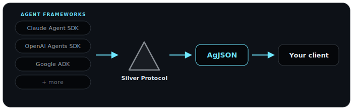

<p align="center">
  
</p>

<h1 align="center">Silver Protocol · AgJSON</h1>

<p align="center">
  <b>The open, neutral, typed transport for normalized agent-framework I/O.</b><br/>
  Write your client once, then plug in any agent framework it has a normalizer for.
</p>

<p align="center">
  <a href="https://silverprotocol.io/AgJSON"></a>
  <a href="./LICENSE"></a>
  <a href="https://www.npmjs.com/package/@silverprotocol/core"></a>
  <a href="https://silverprotocol.io"></a>
</p>

---

Every agent framework — Claude Agent SDK, OpenAI Agents SDK, Google ADK, LangGraph,
Vercel AI SDK — streams its own shape of events. Build a client, a UI, or a tool
that works across more than one of them and you end up writing (and maintaining) a
bespoke adapter per framework.

**AgJSON is the wire format that ends that.** It normalizes any framework's native
event stream into one typed, versioned, forward-compatible shape — so a client
written against AgJSON works with every framework a normalizer exists for, today and
after the next SDK release.

<p align="center">
  
</p>

## Two SDKs, one event vocabulary

The same “call the echo tool” interaction, as each framework actually emits it — a
single fat message from Claude, a stream of deltas from OpenAI — converging onto the
**exact same AgJSON events**. (Full runnable fixtures in [`examples/convergence-echo`](./examples/convergence-echo).)

```jsonc
// Claude Agent SDK — one message carries the whole tool call
{ "type": "assistant", "message": { "content": [
  { "type": "tool_use", "id": "toolu_echo", "name": "echo", "input": { "text": "hi" } }
] } }
```

```jsonc
// OpenAI Agents SDK — the same call arrives as streamed deltas
{ "type": "response.output_item.added",
  "item": { "type": "function_call", "name": "echo", "call_id": "call_Ewi…" } }
{ "type": "response.function_call_arguments.delta", "delta": "{\"text\":\"hi\"}" }
```

<p align="center">
  <sub><b>N O R M A L I Z E</b></sub><br/>▼
</p>

```jsonc
// AgJSON — identical from either SDK
{ "type": "tool.start",          "name": "echo", "toolCallId": "…" }
{ "type": "tool.args.assembled", "input": { "text": "hi" } }
{ "type": "tool.done",           "outcome": "ok",
  "content": [{ "type": "text", "text": "echo: hi" }] }
```

## Why AgJSON

- **Typed, not `any`.** Every event and block is a discriminated-union member — no
  `Record<string, unknown>` escape hatches for shaped data.
- **Streaming-first.** A stateful, per-invoke normalizer — `push(native): AgEvent[]`
  / `flush(): AgEvent[]` — folds a live stream into a persisted `AgReduceResult` via
  the normative `reduce()`.
- **Respects the UI layer.** AgJSON carries content and interaction anchors (Layer-A);
  rendering is left to **MCP Apps** and **A2UI** — no reinvented component schema.
- **Forward-compatible by rule.** Unknown event types and unknown fields are always
  safe to ignore, so a v1.0 client keeps working as the spec grows.

## Get started

```bash
npm install @silverprotocol/core @silverprotocol/claude-agent-sdk
# or @silverprotocol/openai-agents / @silverprotocol/google-adk
```

```ts
import { createClaudeNormalizer } from "@silverprotocol/claude-agent-sdk";
import { ingestAgEvents, Reducer } from "@silverprotocol/core";

// produce: native framework stream → framework-neutral AgJSON
const n = createClaudeNormalizer();
const agEvents = [];
for await (const native of claudeStream) agEvents.push(...n.push(native));
agEvents.push(...n.flush());

// consume: AgJSON → the messages/turns object graph your UI renders
const reducer = new Reducer();
for (const ev of ingestAgEvents(agEvents)) reducer.push(ev);
const { messages, turns } = reducer.result();
```

## The spec

The normative AgJSON v1 specification lives here in **[`SPEC.md`](./SPEC.md)** and is
rendered at **[silverprotocol.io/AgJSON](https://silverprotocol.io/AgJSON)**.
Wire version `1.0.0-draft.1` — **Draft**, stable enough to build on, and we want your
framework's edge cases before the v1 freeze.

## SDKs

Each SDK is developed in its own repository. `core` plus a per-framework normalizer is
all you need.

| Language | Packages | Repository | Status |
| --- | --- | --- | --- |
| TypeScript | `@silverprotocol/core`, `@silverprotocol/claude-agent-sdk`, `@silverprotocol/openai-agents`, `@silverprotocol/google-adk` | [silverprotocol/typescript-sdk](https://github.com/silverprotocol/typescript-sdk) | Shipped |

More languages land the same way. Want a normalizer for your framework or language?
[Open an issue](https://github.com/silverprotocol/typescript-sdk/issues) — normalizers
are community-contributable.

## Contributing

Protocol-level discussion (spec questions, new event types, framework mappings) belongs
here. Bugs and PRs for a specific SDK go to that SDK's repository. See
[`CONTRIBUTING.md`](./CONTRIBUTING.md).

## License

MIT — see [`LICENSE`](./LICENSE). Applies to the specification text and the reference
SDKs.

<sub>Hero image © Encyclopædia Britannica, Inc., used under <a href="https://www.britannica.com/bps/license/creative-commons-legal-code/623330">CC BY 4.0</a>.</sub>
